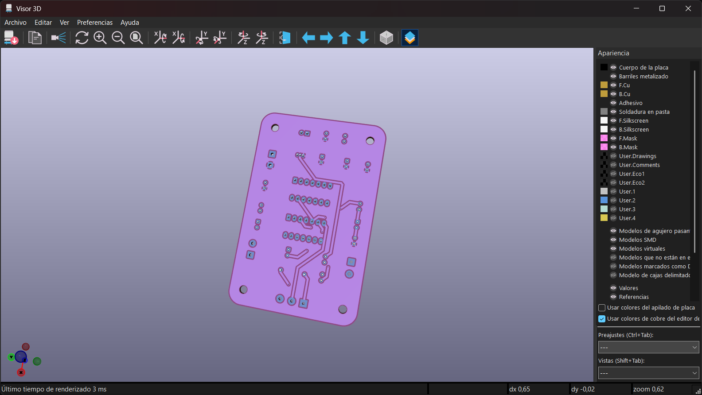
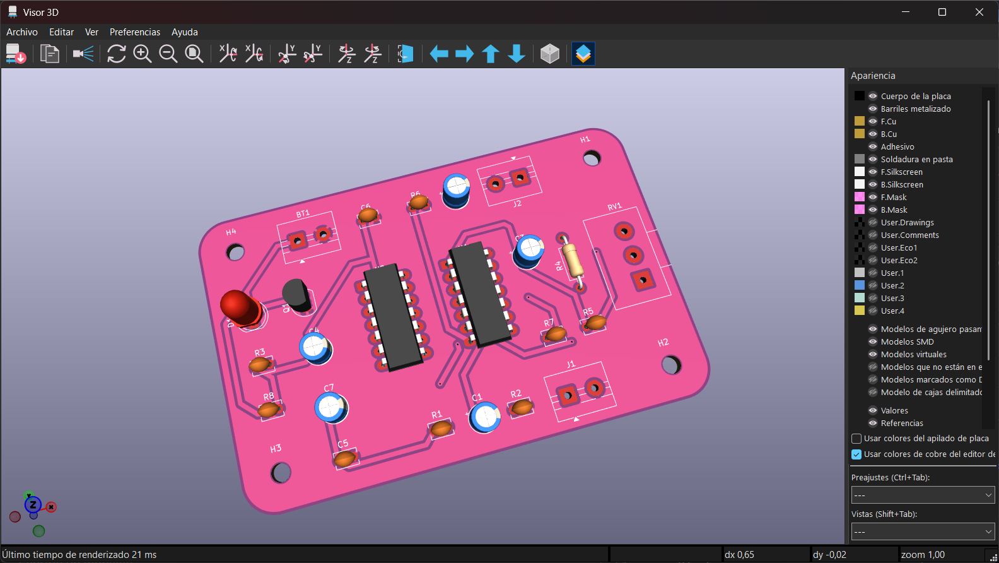

# sesion-10b

# Apuntes clase 22/05

Durante esta clase nos dedicamos a trabajar de manera grupal en lo que haríamos para el proyecto 02, por lo que nos juntamos con mi grupo de trabajo (grupo 01 - piezo) y repasamos nuevamente las ideas que habíamos hablado durante la clase anterior.

Para contextualizar, en el proyecto 02 se nos indicó crear grupos de 5 personas para que cada grupo se encargue de una de las siguientes opciones:

1. Piezo
2. Secuenciador
3. Oscilador (1)
4. Oscilador (2)
5. Filtro
6. Percusión

Cada grupo debe entregar dos módulos distintos incluyendo el esquemático, pcb y una prueba de que funcionan en protoboard, por lo que con mi grupo tuvimos las siguientes ideas:

#### Opción 1

Utilizar el piezo como entrada con pequeños golpes utilizando como referente al juego "Taiko no Tatsujin", el cual es un juego rítmico en donde tienes que golpear un tambor taiko (tambor tradicional japonés) al ritmo de la música. Como primera idea queríamos que con cada golpe en el piezo se permita el paso de uno de los steps del 4017, pero como decisión final quedamos en que preferiamos que con un golpe se forme un loop de uno de los steps y que éste se apague dando otro golpe en el piezo.

#### Opción 2

Utilizar el piezo como entrada pero que este responda a las vibraciones que uno puede generar en la garganta, por lo que necesitamos que el piezo se encuentre pegado a la piel lo cual queremos lograr al usarlo como un collar del estilo choker. Al inicio pensamos que se podría hacer con las pcb flexibles, pero en este caso no lo podremos hacer ya que tenemos que utilizar las placas sólidas al igual que el resto de nuestros compañeros.

Como no podemos hacer la placa flexible, decidimos alargar la conexión del piezo para que este se pueda utilizar en el cuello siendo afirmado por un collar tipo choker que se hará aparte. En esta opción lo que permitirá el paso es la vibración que se provocará en el piezo con la garganta del usuario.

Para poder guiarnos en que basarnos Misa nos entregó esquemáticos en base a lo que queríamos lograr y nos pusimos a trabajar en lo que sería la pcb. Para poder distribuirnos el trabajo, unos compañeros se encargaron de hacer el esquemático de cada opción y otros nos encargamos de asignar huellas y darle forma a la PCB dentro de KiCad. Este fue el resultado de mi aporte:

---

## Capítulo 6 y 7 - Hacia una filosofía de la fotografía, Flusser

#### Vocabulario con definiciones de la RAE

---

## Visita a CEINA - For Want Of (Not) Measuring
